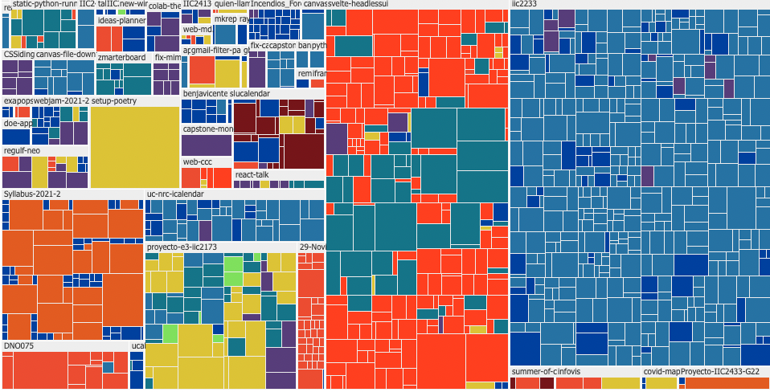

# Entregas Visualización de Datos

## Examen



En el examen realicé una visualización para analizar, consultar y
resumir la actividad que hay en diferentes repositorios de GitHub
de una cuenta en específico, teniendo en consideración la cantidad
de cambios de los commits, la fecha, el autor y el repositorio.

### Generación de datos

Para los datos, se creó un script en JS/[`zx`](https://github.com/google/zx)
que ve que repositorios tiene una cuenta de GitHub (utilizando su API)
y luego clona solo la información de Git de cada uno de ellos.

Una vez instaladas las dependencias (ver `package.json`), se puede
ejecutar el script con:

```sh
./bin/h-organization-stats.mjs --login <nombre usuario>
```


Para ver esos datos en la visualización, se tiene que agregar
los datos generados al directorio `data` (como `<nombre usuario>.json`),
y añadir un tag HTML de la forma:

```html
<div class="org-commits-vis" data-login="<nombre usuario>"></div>
```
